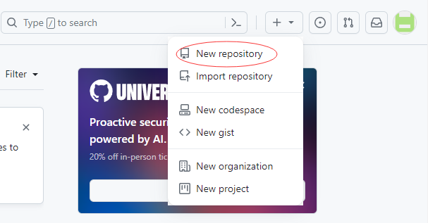
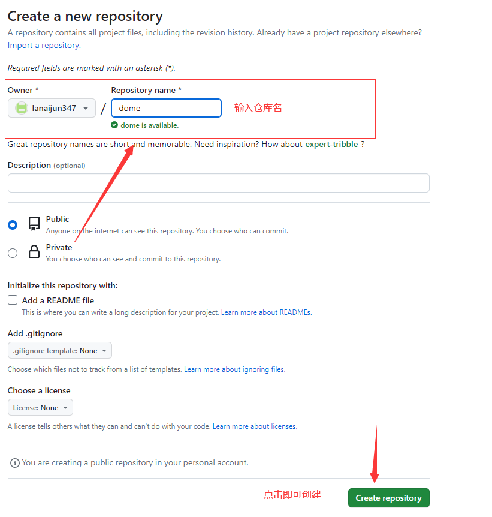
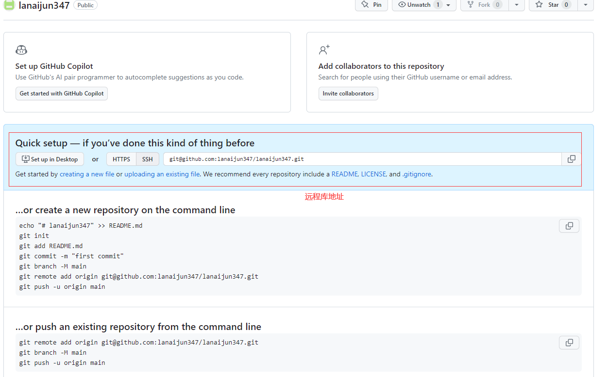

# Git的基础教程

## 一、概述

**Git** : 是一个免费、开源的分布式版本控制系统，是一种工具，用于代码的存储和版本控制。

**GitHub** : 外网代码管理仓库。

**Gitee** : 国内代码管理仓库，能迁移GitHub的代码。

**GitLab** : 一般用于局域网搭建的代码管理仓库。

## 二、Git安装

1. **git** [官网下载链接](https://git-scm.com/) : <https://git-scm.com/。>
2. 安装一直点下一步即可。

## 三、Git常用命令

|命令名称|作用
|---|---
|git config --global user.name 用户名|设置用户签名
|git config --global user.email 邮箱|设置用户签名
|**git init**|**初始化本地库**
|**git status**|**查看本地库状态**
|**git add 文件名**|**添加到暂存区**
|**git commit -m "日志信息"**|**提交到本地库**
|**git reflog**|**查看历史记录**
|**git reset --hard 版本号**|**版本穿梭**

### 3.1 设置用户签名

1.基础语法

```None
git config global user.name 用户名
git config global user.email 邮箱
```

说明：签名的作用是区分操作者身份。用户签名的信息在每一个版本的提交信息中能够看到，以此确认本次提交是谁做的。**Git首次安装必须设置一下用户签名，否则无法提交代码**。

**注意：** 这里设置的用户签名和将来登录 GitHub （或者其他代码托管中心） 的账号没有任何关系。

### 3.2 <mark>初始化本地库</mark>

1.基础语法

```git init```

初始化本地库，会在当前文件夹生成一个 `.git` 文件夹。

### 3.3 查看当前状态

1.基础语法

```git status```

查看当前状态:


```None
On branch master 表示当前分支为 master
No commits yet  表示未提交过数据/没有东西可以提交
nothing to commit 表示当前无东西可以提交
```

### 3.4 添加/删除暂存区数据

1.添加到暂存区基础语法

```git add 文件名/文件夹名```

2.删除暂存区数据基础语法

```git rm --cached 文件名/文件夹名```

### 3.5 提交数据到本地库

1.基础语法

`git commit -m "日志信息" 文件名/文件夹名`

使用 git status 查看提交状态

使用 git reflog 查看版本信息

使用 git log 查看详细log内容

### 3.6 历史版本

1. 查看历史版本
   * `git reflog` 查看版本信息
   * `git log`  查看版本详情信息
2. 版本穿梭
   * `git reset --hard 版本号` 版本回溯

## 四、Git分支

### 4.1 分支概述

**分支的概念：** 可以认为分支就是当前工作目录中代码的一份副本。使用分支，可以让我们从开发主线上分离出来，以免影响开发主线。

**分支优点：** 同时并行多个功能开发，提高开发效率。各个分支在开发过程中，不会对其他分支有任何影响。

### 4.2 分支的操作命令

|命令名称|作用
|--|--
|git branch 分支名|创建分支
|git branch -v|查看分支
|git checkout 分支名|切换分支
|git merge 分支名|把指定分支合并到当前分支

### 4.3 合并冲突处理

1）合并产生冲突时


2）查看冲突文件


3）修改冲突文件

把文件中多出的 `<<<`、`>>>>`、`===`等特殊符号删除，保留想要数据，例如只保存`hello git github`，删除`hello git gitee`。

4）重新提交数据

使用 `git add hello.txt` 重新提交数据。

5）提交到本地库

使用 `git commit -m "日志信息"` 提交到本地库，即可解决。

## 五、GitHub操作

[GitHub官网](https://github.com/) : <https://github.com>

### 5.1创建远程库







### 5.2 远程仓库操作命令

|命令名称|作用
|--|--
|git remote -v|查看当前所有远程地址别名
|git remote add 别名 远程地址|起别名
|**git push 别名 分支**|**推送本地分支上的内容到远程仓库**
|**git clone 远程地址**|**将远程仓库的内容克隆到本地**
|**git pull 远程库地址别名 远程分支名**|**将远程仓库对应分支最新内容拉取后与当前本地分支直接合并**

### 5.3 创建远程仓库别名

1）基本语法

`git remote -v` 查看当前所有远程地址别名
`git remote add 别名 远程地址`  别名建议使用库名

### 5.4 推送到远程库

1）基本语法

`git push 别名 分支`

### 5.5 拉取

1）基本语法

`git pull 远程库地址别名 远程分支名`

### 5.6 SSH 免密登录

1）在 `C盘/用户/用户名` 下，右键运行 `Git bash here`

2）执行命令 `ssh-keygen -t rsa -C Github的账号邮箱`

3）连续敲3次回车

4）在该路径下会生成 `.ssh` 目录，该目录有：`id_rsa` (私钥)、`id_rsa.pub` (公钥) 两个文件

5）在GitHub设置里面找到 `SSH and GPG keys`

6）选择 `New SSH key`

7）在 `Title` 中输入自定义名称，建议使用Windows名称

8）将公钥文件的数据拷贝到 `Key` 中，点击 `Add SSH key` 即可

### 5.4 配置Git忽略文件

忽略与项目的实际功能无关，不参与服务器上部署运行。

操作：

1）创建忽略规则文件 `xxx.ignore` (前缀名随便起，建议使用 git.ignore)

2）文件的存放位置原则上放哪都可以， 建议放在 `C盘/用户/用户名` 与 `~/.gitconfig` 一起

文件模板如下：

```None
# Compiled class file
*.class
 
# Log file
*.log
 
# BlueJ files
*.ctxt
 
# Mobile Tools for Java (J2ME)
.mtj.tmp/
 
# Package Files #
*.jar
*.war
*.nar
*.ear
*.zip
*.tar.gz
*.rar
 
# virtual machine crash logs, see http://www.java.com/en/download/help/error_hotspot.xml
hs_err_pid*
 
.classpath
.project
.settings
target
.idea
*.iml
```

3）在.gitconfig文件中引用忽略配置文件（此文件在Windows的家目录中）

```None
[user]
 name = usename
 email = email@qq.com
[core]
 excludesfile = C:/Users/asus/git.ignore
注意：这里要使用“正斜线（/）”，不要使用“反斜线（\）”
```

### 5.5 解决 提交或克隆报错fatal: unable to access 'xxx.git/': SSL certificate problem: unable to get local issuer certificate

> 错误： git SSL certificate problem: unable to get local issuer certificate

这个问题是由于没有配置信任的服务器HTTPS验证。默认，cURL被设为不信任任何CAs，就是说，它不信任任何服务器验证。

只需要执行下面命令就可以解决：

`git config --global http.sslVerify false
`
